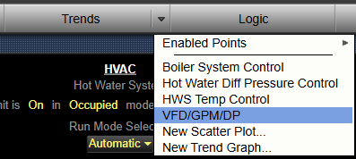
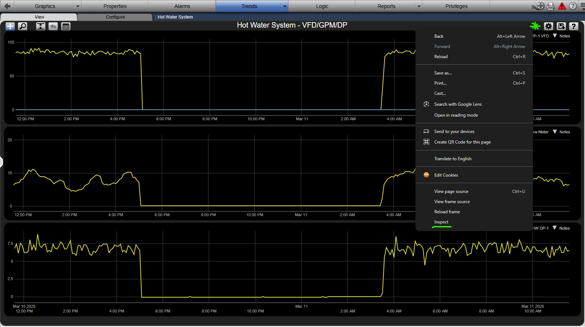
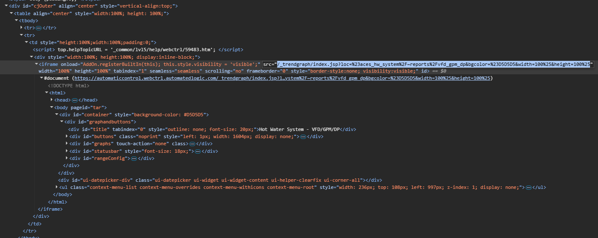

# CookieLoginUtility

WebCTRL is a trademark of Automated Logic Corporation. Any other trademarks mentioned herein are the property of their respective owners.

This WebCTRL add-on allows scripts to bypass a limitation of headless chrome so that certain login cookies may be specified in query string parameters. The primary usage for this add-on is to automatically download and email a PDF of selected trend graphs. This requires some custom scripts and a scheduled task in addition to the add-on. Example scripts are provided below.

# Usage

- If your server requires signed add-ons, copy the authenticating certificate [*ACES.cer*](https://github.com/automatic-controls/addon-dev-script/blob/main/ACES.cer?raw=true) to the *./programdata/addons* directory of your *WebCTRL* installation folder.
- Install [*CookieLoginUtility.addon*](https://github.com/automatic-controls/cookie-addon/releases/latest/download/CookieLoginUtility.addon) using the *WebCTRL* interface.
- Download the scripts from [./pdf-script](https://github.com/automatic-controls/cookie-addon/releases/latest/download/pdf-script.zip) to your computer, and place them in an empty folder.
- Setup and trend graph page and determine a direct link to it.
  - Navigate to the trend graph page.
  
  

  - Right-click on the trend graph title bar to the left of the gear, and hit the **Inspect** button.
  
  

  - Double-click on the **src** attribute on the iframe and copy the relative link.

  

  - Complete the relative link to get a full URL like: https://webctrl.something.net/_trendgraph/index.jsp?loc=%23aces_hw_system%2F~reports%2Fvfd_gpm_dp&bgcolor=%23D5D5D5&width=100%25&height=100%25
  - Naviagate to the completed URL to verify that it works.
- Edit your downloaded copy of [*main.ps1*](./pdf-script/main.ps1) to set the required parameters. The `target` parameter is the trend graph URL you found in the previous step. The `url` parameter is the root WebCTRL url (https://webctrl.something.net/). You'll also need to provide WebCTRL login credentials and some email server connection parameters.
- Start [*exec.bat*](./pdf-script/exec.bat) to run the script. If it doesn't work, you may try uncommenting the `REM pause` line in *exec.bat* to see if any errors are shown before the command prompt closes.
  - Note that these scripts require an installation of [Google Chrome](https://www.google.com/chrome/dr/download/) and [curl](https://curl.se/windows/). Newer versions of Windows come with a default installation of curl, but it may need to be updated if you run into issues.
- You can schedule *exec.bat* in Windows task scheduler however you wish.